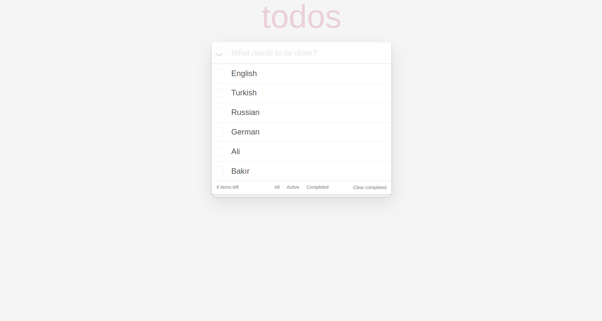

# todos

The project's goal is to use more states and lifecycles, create properties, use components, and use local storage.

# Used Technologies

* CSS
* JavaScript
* React.js

# Project Usage

You can launch the project using the command below after downloading it.

`yarn start`

# Project Appearance

# Author

- Github - [Ali Bakır](https://github.com/ali-bakir)
- Linkedin - [Ali Bakır](https://www.linkedin.com/in/ali-bakir/)

